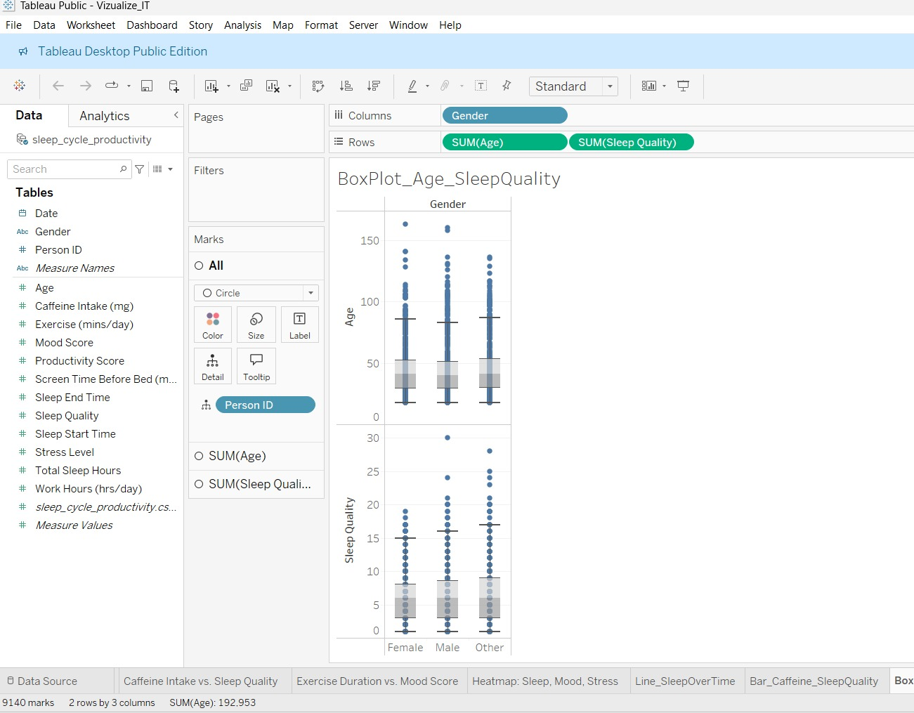
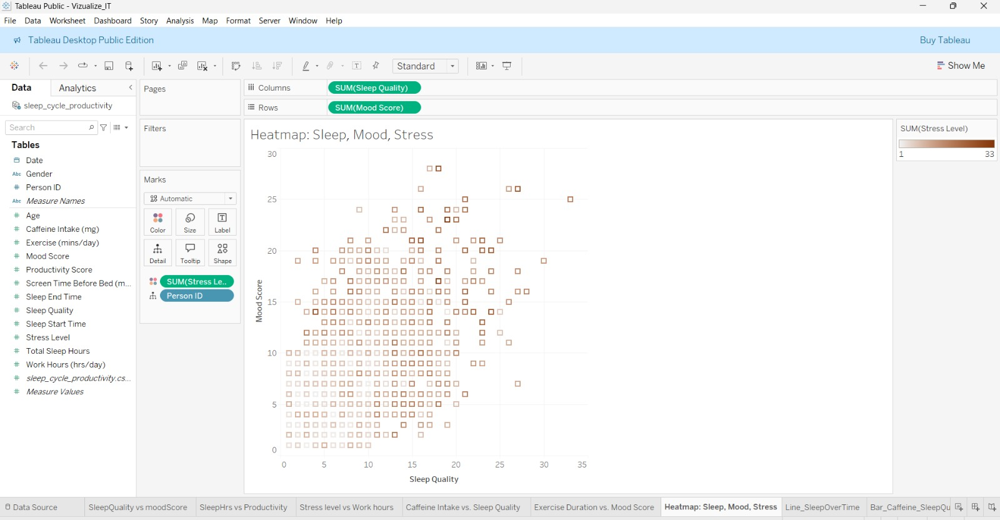
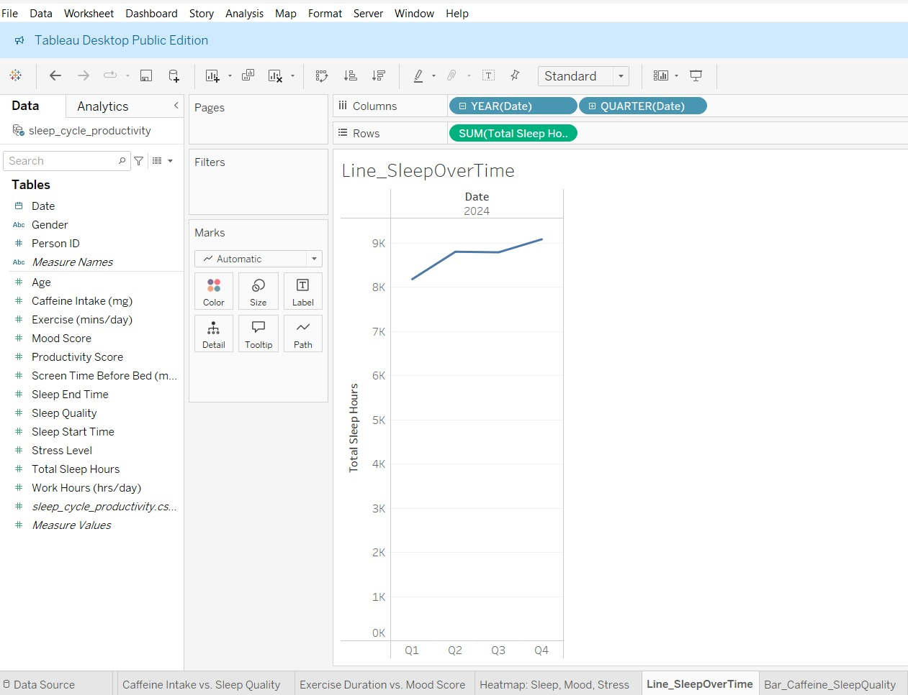

# Mood-Meter-Dashboard
## Mood-Meter Dashboard
## Overview  
This project analyzes mood patterns using datasets and visualizes insights using Tableau. The repository contains:

- 📊 **Datasets (.csv):** Used for analysis and visualization.  
- 🐍 **Python Script:** For data processing and analysis.  
- 📈 **Tableau File:** Contains interactive visualizations of mood-related data.  

## Visualizations  

 
